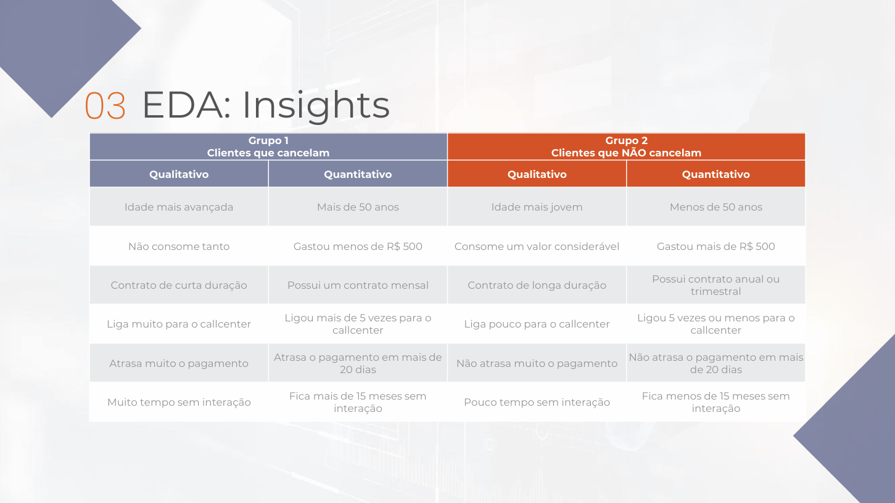
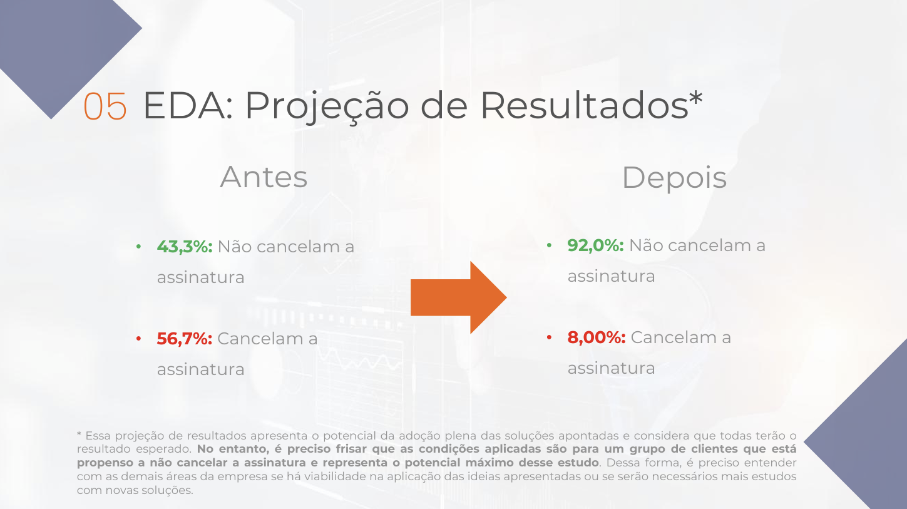
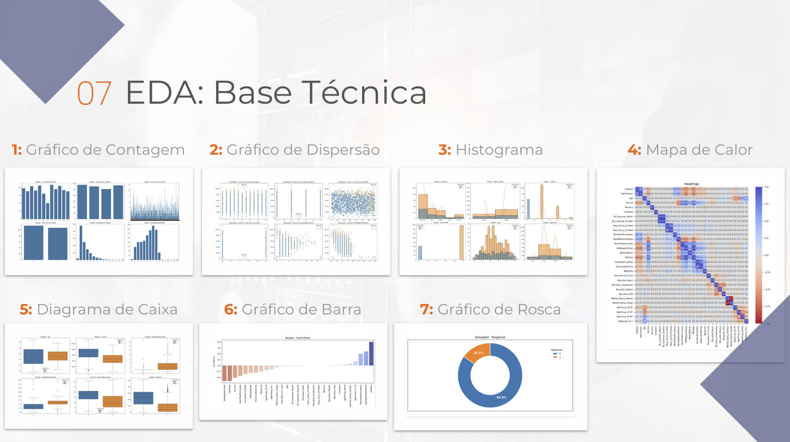

# Spark - Projeto Final 1

## Projeto
**Análise exploratória** das principais causas de churn em uma telecom com PySpark

## Descrição
Nesse projeto de Análise de Dados foi realizada uma ampla análise exploratória gerando insights do projeto e permitindo identificar as principais causas de churn em uma telecom. Para isso foram utilizados indicadores estatísticos como histogramas, boxplots, mapa de calor e gráfico de correlações, a fim de ressaltar as principais diferenças no comportamento dos clientes que cancelam o serviço. Com base nos resultados encontrados nesse projeto, é possível fazer um grande trabalho com as demais áreas da empresa para que seja traçado um plano de ação afim de reduzir o índice de churn dos clientes. Em relação a parte técnica, as bibliotecas utilizadas no projeto foram: PySpark, Pandas, Numpy, Matplotlib e Seaborn. Para análise e extração de insights foram utilizados gráficos e visualizações como: gráficos de dispersão, histogramas, mapas de calor, diagramas de caixa, gráficos de barras e gráficos de rosca. E por fim, a arquitetura usada para estruturar todo esse projeto foi a arquitetura medallion, segmentando os dados de acordo com a camada de sua finalidade: resource, bronze, silver e gold.

## Resultados - Projeto

## Resultados - EDA

## Resultados - Conclusão
